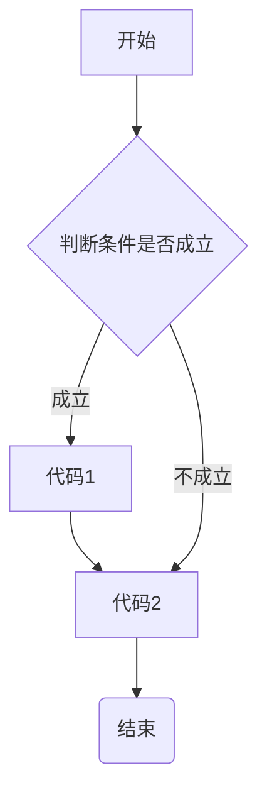
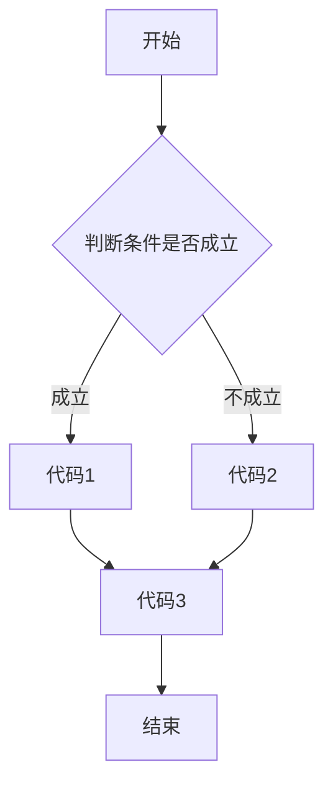
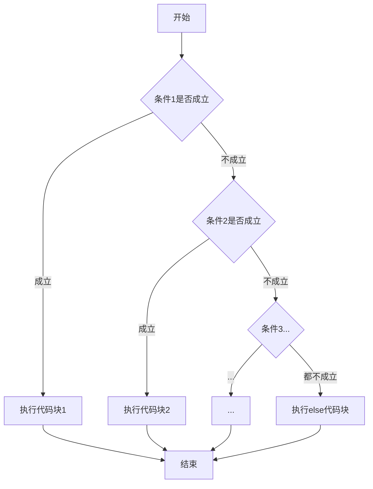
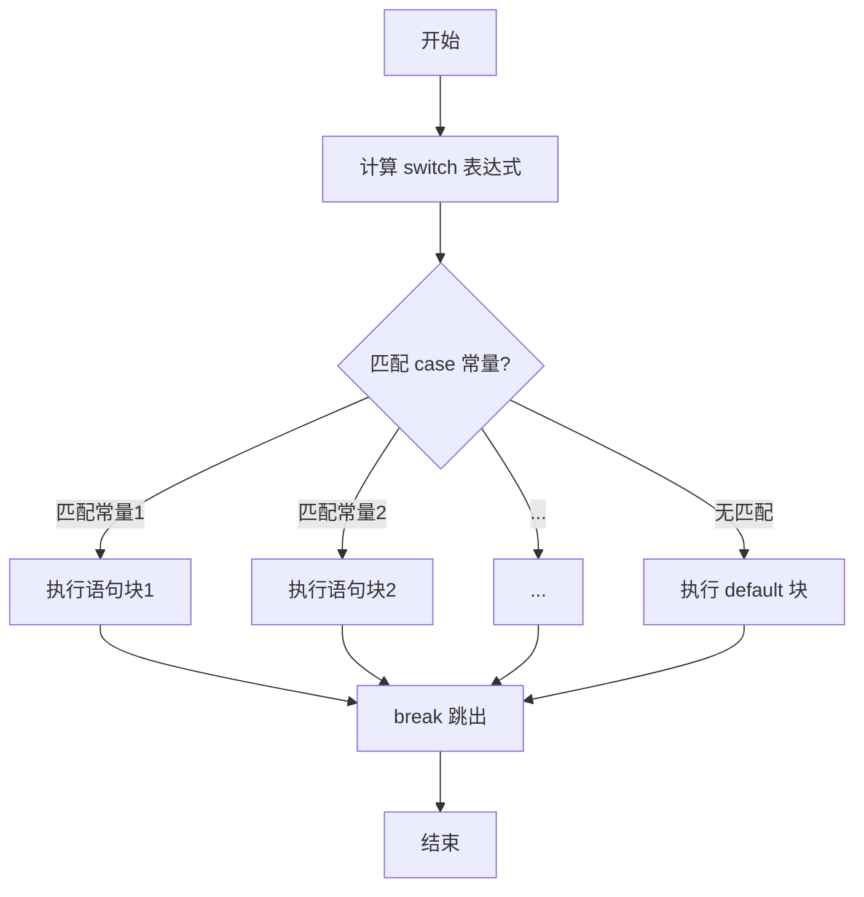
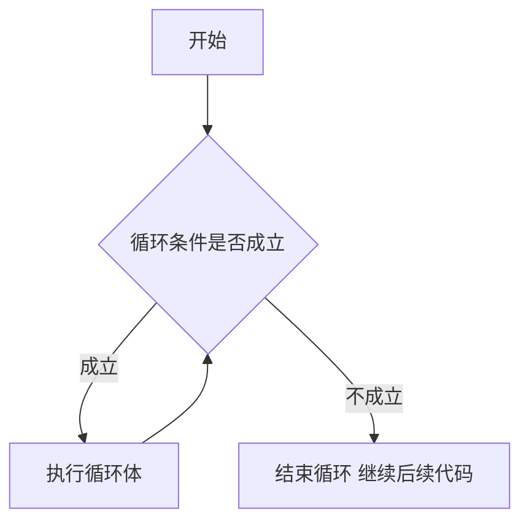
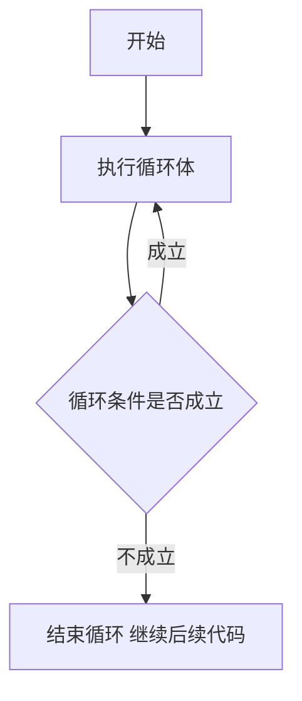
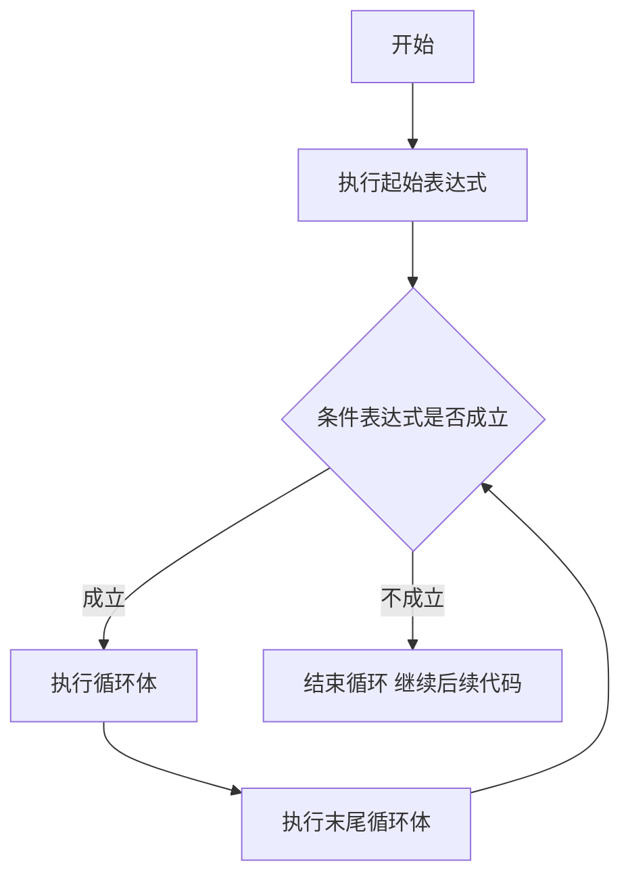
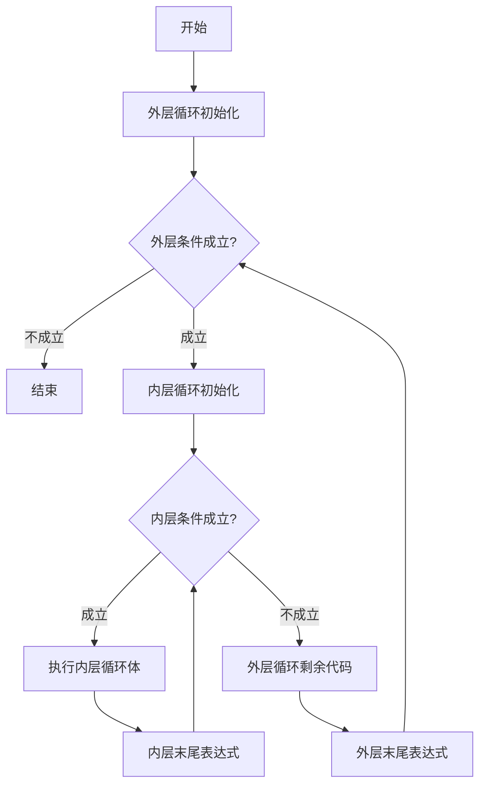
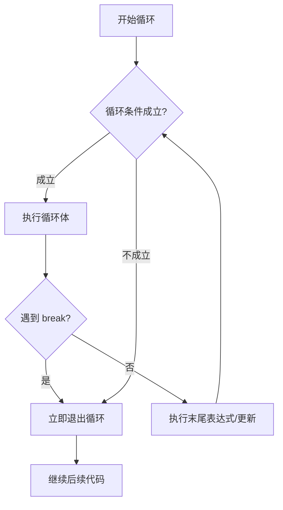

# C ++ 教程

## 1.1输出

```cpp
#include <iostream>
using namespace std;
int main() {
    cout  << "Hello, World!" << endl;
    return 0;
}
```

其中，`using namespace std;`**不建议在头文件中使用**

> 防止**命名污染**

**不使用`using namespace std;`写法如下**

```cpp
#include <iostream>
int main(){
  std::cout<< "Hello,World!" <<std::endl;
  return 0;
}
```

> 额外小提示

> 用 `\n`代替 `std::endl`：如果只是换行而不需要强制刷新输出缓冲区，用 `\n`效率更高。

```cpp
std::cout << "Hello, World!\n";
```

`return 0;` 在 main 中可省略（编译器会自动加上），但显式写出是良好习惯。

同时，因为cpp同时兼容c语言所以也可以使用`printf`函数，如下文

```cpp
#include <stdio.h>
int main(){
  printf("Hello, World \n");
  return 0;
}
```

`控制台输出 cpp`

```cpp
Hello, World 
```

| 特性   | cout            | printf               |
| ---- | --------------- | -------------------- |
| 类型安全 | 自动推导类型无需格式符     | 格式符与参数类型不匹配时会出错      |
| 性能   | 稍慢              | 通常略快                 |
| 可扩展性 | 可通过运算符重载支持自定义类型 | 无法直接打印自定义类对象         |
| 推荐场景 | C++ 项目默认选择      | 与 C 代码混用，或对性能极端敏感的场景 |

## 2.1变量

**变量** : 给一段内存空间取名，方便操作与管理这段内存

**语法** `数据类型 变量名 = 初始值;`

在一些情况我们也可以不定初始值但是这样变量的值就是不确定的(对于局部变量而言)

### 为什么要用变量？

在高级语言中，我们通过变量名来标识和操作内存中的数据，而不必直接记忆内存地址，如果没有变量名，我们要记住各个内存地址，比如，小明的年龄在内存0x00中，他的身高在0x03中，他的学号在0x07中若干个数据只用内存地址管理，记忆成本极高，不如起个名字来得方便

> **注意**：未初始化的局部变量的值是不确定的（包含“垃圾值”），直接使用会导致程序行为不可预测，甚至报错。建议声明变量时总是赋予初始值。

### 创建变量

C++有多个数据类型，其中`int`是最常用的数据类型之一，我们使用int来创建一个变量

```cpp
#include <iostream>
using namespace std;
int main() {
    int week = 7;
    cout  << week << endl;
    return 0;
}
```

`控制台输出 - cpp`

```cpp
7
```

在C++中 我们可以使用多个`<<`追加输出，

```cpp
#include <iostream>
using namespace std;
int main() {
    int week = 7;
    cout  << "一周有 " <<week  <<" 天"<< endl;
    return 0;
}
```

`控制台输出-cpp`

```cpp
一周有 7 天
```

**注意，输出变量不可使用`""`否则会输出字符串**

其中变量可以被修改

```cpp
#include <iostream>
using namespace std;
int main() {
    int a = 0;
    cout  << "a = " << a << endl;
    a = 1;
    cout << "now a = "<< a <<endl;
    return 0;
}
```

`控制台输出-cpp`

```cpp
a = 0
now a =1
```

> 在实际操作中我们可以在同一行定义多个变量，**语法**`数据类型 变量1 = 值 , 变量2 = 值;//可以有多个变量`

---

## 2.2常量

**作用用于记录程序中不可更改的数据**
C++拥有两种定义常量的方式

### 2.2.1 宏常量

语法 `#define 常量名 常量值`通常在文件上方定义，表示一个常量，没有类型

### 2.2.2 修饰

语法 `const 数据类型 常量名 = 常量值`
本质上是修饰变量为一个常量，通常在定义变量时在前面加`const`

那我们上一个程序来讲，一周有七天是一个公认事实，一周有七天不会改变，那我们可以把他以常量的形式保存

```cpp
#include <iostream>
using namespace std;
int main() {
    const int week = 7;
    cout  << "一周有 " <<week  <<" 天"<< endl;
    return 0;
}
```

`控制台输出-cpp`

```cpp
一周有 7 天
```

因为常量不可修改

```cpp
#include <iostream>
using namespace std;
int main() {
    const int week = 7;
    week = 54;
    cout  << "一周有 " <<week  <<" 天"<< endl;
    return 0;
}
```

`控制台输出-cpp`

```cpp
没有输出，编译器报错
```

注意**在定义变量与常量的时候不要使用关键字作为变量名或常量名**
因为关键字是cpp已经使用过的，你在使用就容易冲突
就像你给你的家用车刷警车的车皮，警车看到分分钟来找你

---

## 2.3 数据类型

### 2.3.1 整型

#### 作用 **整型变量表示的是整数类型的数据**

C++中可以表示的整型如下（常用）

| 数据类型      | 范围                                    | Win | 64Linux | 32Linux |
| --------- | ------------------------------------- | --- | ------- | ------- |
| short     | (-2<sup>15</sup> ~ 2<sup>15</sup>-1 ) | 2   | 2       | 2       |
| int       | (-2<sup>31</sup> ~ 2<sup>31</sup>-1)  | 4   | 4       | 4       |
| long      | (-2<sup>31</sup> ~ 2<sup>31</sup>-1)  | 4   | 8       | 4       |
| long long | (-2<sup>63</sup> ~ 2<sup>63</sup>-1)  | 8   | 8       | 8       |

> 补充关键字 unsigned

> 如果需要表示非负整数（如年龄、数量），可以用 unsigned 扩大正数范围：

```cpp
unsigned int score = 100;      // 范围：0 ~ 4294967295
unsigned short count = 65535;  // 范围：0 ~ 65535
```

用 sizeof 查看实际大小

```cpp
#include <iostream>
int main() {
    std::cout << "short: " << sizeof(short) << " 字节\n";
    std::cout << "int: " << sizeof(int) << " 字节\n";
    std::cout << "long: " << sizeof(long) << " 字节\n";
    std::cout << "long long: " << sizeof(long long) << " 字节\n";
    return 0;
}
```

`控制台输出-cpp，Windows`

```cpp
short: 2 字节
int: 4 字节
long: 4 字节
long long: 8 字节
```

---

### 2.3.2实型（浮点型）

**作用** ： 表示小数

1.单精度浮点数 `float`

2.双精度浮点数 `double`

两者表示的精度不同

| 数据类型   | 占用空间(byte) | 有效数字范围 |
| ------ | ---------- | ------ |
| float  | 4          | 7      |
| double | 8          | 15~16  |

```cpp
#include <iostream>
using namespace std;
int main() {
    float a = 1.0f;
    double b = 1.0;
    cout << "a: " << a << endl;
    cout << "b: " << b << endl;
    return 0;
}
```

**在C++中，浮点数默认是double类型，如果要使用float类型，必须在数字后面加上f，否则不管你的数据类型写的是什么计算机一律认为是double类型**

> 默认情况下输出一个小数，会显示出6位有效数字

`控制台输出-cpp`

```cpp
a: 1
b: 1
```

查看二者占用内存

```cpp
#include <iostream>
using namespace std;
int main() {
    cout << "the float in ram : " << sizeof(float) << " byte" << endl;
    cout << "the double in ram : " << sizeof(double) << " byte" << endl;
    return 0;
}
```

`控制台输出-cpp`

```cpp
the float in ram : 4 byte
the double in ram : 8 byte
```

#### 2.3.2.1 科学计数法

在浮点数中，科学计数法写作 `xey`其中x，y是代数

一般表示 

$$
x \times 10^y
$$

示例代码

```cpp
#include <iostream>
using namespace std;
int main() {
    float a = 4e5;
    cout << a << endl;
    return 0;
}
```

`控制台输出-cpp`

```cpp
400000
```

---

### 2.3.4 字符型

作用**用于显示单个字符**

语法：`char 变量名 = 值`

> 提示 在显示字符型变量时，用**单引号**把字符括起来，切记不要使用双引号，单引号内通常只能有一个字符！！，超过一个会产生实现定义的行为，非常不推荐！

代码示例

```cpp
#include <iostream>
using namespace std;
int main() {
    char a = 'a';
    cout << a << endl;
    return 0;
}
```

`控制台输出-cpp`

```cpp
a
```

查看占用内存

```cpp
#include <iostream>
using namespace std;
int main() {
    cout << "the char in ram : " << sizeof(char) << " byte" << endl;
    return 0;
}
```

`控制台输出-cpp`

```cpp
the char in ram : 1 byte
```

查看字符对应ASCII编码值

```cpp
#include <iostream>
using namespace std;
int main() {
    char a = 'a';
    char A = 'A';
    cout << (int)a << endl;
    cout << (int)A << endl;
    return 0;
}
```

`控制台输出-cpp`

```cpp
97
65

```

**注意，同字母大小写，编码不同**

---

### 2.3.5 字符串型

作用 ：**用于表示一串字符**

#### 2.3.5.1 C语言风格

语法 `char 变量名[] = “字符串值”`

示例

```cpp
#include <iostream>
using namespace std;

int main() {
    char s1[] = "Hello, world";
    cout << s1 << endl;
    return 0;
}
```

`控制台输出-cpp`

```cpp
Hello, world
```

#### 2.3.5.2 C++风格

语法 `string 变量名 = "字符串值"`

> 在使用C++风格的字符串时要导入string库
> 
> 高版本Visual Studio可以不导入，但是为了提高代码质量，最好加上`#include <string>`

代码示例

```cpp
#include <iostream>
#include <string>
using namespace std;

int main() {
    string s1 = "Hello, world";
    cout << s1 << endl;
    return 0;
}
```

----

### 2.3.6布尔数据类型

**作用** : 储存 逻辑真 或 逻辑假

| 值     | 占用字节大小 | 本质  |
| ----- | ------ | --- |
| true  | 1byte  | 1   |
| false | 1byte  | 0   |

代码示例：

```cpp
#include <iostream>
#include <string>
using namespace std;
int main() {
    bool t = true;
    bool f = false;
    cout << t << endl;
    cout << f << endl;
    cout << "the bool in ram is " << sizeof(bool) << " byte" << endl;
    cout << boolalpha << f << endl;
    cout << boolalpha << t << endl;
    return 0;
}
```

> `boolalpha` 是一个流操纵器，用于将布尔值以文本形式输出（true 或 false），而不是默认的数字形式（1 或 0）。当使用 `boolalpha` 时，输出流会将布尔值转换为对应的文本表示。
> 
> `boolalpha` 是持久设置，后续布尔输出都会变成文本形式，直到使用 `noboolalpha` 恢复

`控制台输出`

```cpp
1
0
the bool in ram is 1 byte
false
true
```


---

## 2.4 转义字符

**作用**：在 C++ 中，有一些字符无法直接输入或容易引起歧义（比如换行、制表符、双引号等）。转义字符以**反斜杠 `\`** 开头，用来表示这些特殊字符。

**常见转义字符**

| 转义字符 | 含义           | ASCII 码（十进制） |
| ---- | ------------ | ------------ |
| `\n` | 换行（LF）       | 10           |
| `\t` | 水平制表符        | 9            |
| `\\` | 反斜杠 `\`      | 92           |
| `\'` | 单引号 `'`      | 39           |
| `\"` | 双引号 `"`      | 34           |
| `\r` | 回车（CR）       | 13           |
| `\b` | 退格（BS）       | 8            |
| `\0` | 空字符（字符串结束标志） | 0            |

> **建议**：“`\0` 主要用于 C 风格字符串的结束标志，C++ 的 `std::string` 一般不需要手动添加。”
> 
> `char s1[] = "Hello";` 实际数组长度为 6（包含结尾的 `\0`）

示例代码

```cpp
#include <iostream>
using namespace std;

int main() {

    cout << "Line 1\nLine 2\n";

    cout << "Name\tAge\tScore\n";
    cout << "Alice\t20\t95.5\n";
    cout << "Bob\t19\t88.0\n";

    cout << "Path: C:\\Program Files\\C++\\" << endl;

    cout << "He said: \"C++ is fun!\"" << endl;

    cout << "Character 'A' has ASCII code 65" << endl;

    cout << "abc\bd" << endl; 

    cout << "12345\rABCDE" << endl;

    return 0;
}

```

`控制台输出-cpp`

```cpp
Line 1
Line 2
Name    Age     Score
Alice   20      95.5
Bob     19      88.0
Path: C:\Program Files\C++
He said: "C++ is fun!"
Character 'A' has ASCII code 65
abd
ABCDE
```


---

## 3.1数据输入（初级）

### 作用 获取键盘输入

### 语法 `cin >> 变量`

>  cin是把用户输入的数据写入指定变量，就好比写信，变量就是信纸，你把你的想法写入信纸上

代码演示

```cpp
#include <iostream>
using namespace std;
int main() {
    int a = 0;
    cout << "Enter a number: ";
    cin >> a;
    cout << "The number you entered is: " << a << endl;
    return 0;
}
```

我们假设用户输入的是`129`

`控制台输出-cpp`

```cpp
Enter a number: 129
The number you entered is: 129
```

我们假设用户输入的是`abcdefg`
`控制台输出-cpp`

```cpp
Enter a number: abcdefg
The number you entered is: 0
```

> 为什么会输出0
> 
> 用户输入非数字字符串 `abcdefg` 时，`cin >> a` 会尝试将输入解析为整数。由于输入内容不是有效的整数表示，**读取操作失败**，`cin` 对象会进入错误状态，并且变量 `a` 的值保持不变。因为 `a` 在定义时被初始化为 `0`，所以最终输出 `0`。

> 你可以怎么理解 你的水杯中没有水，你想添加水，可是你添加成了葡萄，水既没有多有没有少
> 
> 不过补充一点技术细节：如果 `a` 在定义时**没有**初始化（比如 `int a;`），那么输入失败时 `a` 会是一个**未定义的值**（可能是随机数，比如62256），而不是保持为 `0`。所以先初始化为 `0` 是个好习惯，这样输出至少是确定的。

但是我们现在有一个疑问，`bool`类型是写入`1`or`0`还是输入`true`or`false`?

我们来试试

```cpp
#include <iostream>
using namespace std;
int main() {
    bool a = 0;
    cout << "Enter a ,the a is bool: ";
    cin >> a;
    cout << "The number you entered is: " << a << endl;
    bool b = 0;
    cout << "Enter b ,the b is bool: ";
    cin >> b;
    cout << "The number you entered is: " << b << endl;
    return 0;
}
```

`控制台输出-cpp`

```cpp
Enter a ,the a is bool: 1
The number you entered is: 1
Enter b ,the b is bool: true
The number you entered is: 0
```

很明显，在我们输入`true`时输出了b的初始值，所以说在输入布尔值时我们应该输入`1`or`0`

> 注意输入布尔值可以输入大于0的整数，比如100，31，128等等，他们都是代表`true`

> **注意** 假设当第一次 `cin >> a` 因为输入 `"true"` 失败后，`cin` 对象会进入 **fail 状态**。在此状态下，后续的所有 `cin` 操作都会**立即跳过，不再等待输入** ，所以第二次 `cin >> b` 实际上没有让用户输入任何内容，而是直接失败并保持 `b = 0`
> 
> 所以当第一次输入true时
> 
> ```cpp
> Enter a ,the a is bool: true
> The number you entered is: 0
> Enter b ,the b is bool: The number you entered is: 0
> ```

## 4.1 运算符

**作用** 执行代码运算
下面是几个基本的运算符类型

| 运算符类型 | 作用                      |
| ----- | ----------------------- |
| 算术运算符 | 处理四则运算                  |
| 赋值运算符 | 将表达式的值赋给变量              |
| 比较运算符 | 比较表达式，并返回`true`或`false` |
| 逻辑运算符 | 根据表达式返回`true`或`false`   |

### 4.1.1 算术运算符

| 运算符 | 术语      |
| --- | ------- |
| +   | 正号，加号   |
| -   | 负号，减号   |
| *   | 乘号      |
| /   | 除号      |
| %   | 取模(取余)  |
| ++  | 前置/后置递增 |
| --  | 前置/后置递减 |

代码演示

```cpp
# include <iostream>
using namespace std;

int main() {
    int a = 10;
    int b = 3;
    cout << "a + b = " << a + b << endl; 
    cout << "a - b = " << a - b << endl;  
    cout << "a * b = " << a * b << endl;  
    cout << "a / b = " << a / b << endl;  
    cout << "a % b = " << a % b << endl;  

    return 0;
}
```

这些是加减乘除取余的运算演示
`控制台输出-cpp`

```cpp
a + b = 13
a - b = 7
a * b = 30
a / b = 3
a % b = 1
```

**注意**
整数除法会截断小数部分，如果需要小数结果，至少有一个操作数是浮点数
取模仅适用于整数，负数的取模结果与平台相关C++11 起，`a % b` 的结果符号与被除数 `a` 相同

代码演示

```cpp
# include <iostream>
using namespace std;

int main() {
    int a = 10;
    double b = 3.0;

    cout << "a / 3 = " << a / 3 << endl; 
    cout << "b / 2 = " << b / 2<< endl;  
}
```

`控制台输出-cpp`

```cpp
a / 3 = 3
b / 2 = 1.5
```

#### 前置/后置递减/递增

```cpp
# include <iostream>
using namespace std;

int main() {
    int i = 5;
    int j = 5;

    cout << "前置 ++i: " << ++i << endl;  // 先自增，再输出 → 6
    cout << "后置 j++: " << j++ << endl;  // 先输出，再自增 → 5
    cout << "j 现在的值: " << j << endl;  // 6

    return 0;
}
```

控制台输出

```cpp
前置 ++i: 6
后置 j++: 5
j 现在的值: 6
```

变量在前（i++）→ 先用原来的值，再自增；++ 在前（++i）→ 先自增，再用新值。
你可以这么理解
前置就好比你在烧饭，那肯定是先烧饭之后吃
后置就好比你吃饭前拍食物，那肯定是先拍后吃

--- 

### 4.1.2 赋值运算符

| 运算符 | 术语   |
| --- | ---- |
| =   | 赋值   |
| +=  | 加等于  |
| -=  | 减等于  |
| *=  | 乘等于  |
| /=  | 除等于  |
| %=  | 取模等于 |

代码演示

```cpp
#include <iostream>
using namespace std;

int main() {
    int a = 10;   // 基本赋值
    int b = 5;

    cout << "初始 a = " << a << ", b = " << b << endl;

    a += b;   // 等价于 a = a + b
    cout << "a += b ， a = " << a << endl;  // 15

    a -= b;   // 等价于 a = a - b
    cout << "a -= b ， a = " << a << endl;  // 10

    a *= b;   // 等价于 a = a * b
    cout << "a *= b ， a = " << a << endl;  // 50

    a /= b;   // 等价于 a = a / b
    cout << "a /= b ， a = " << a << endl;  // 10

    a %= b;   // 等价于 a = a % b
    cout << "a %= b ， a = " << a << endl;  // 0

    return 0;
}
```

`控制台输出-cpp`

```cpp
初始 a = 10, b = 5
a += b ， a = 15
a -= b ， a = 10
a *= b ， a = 50
a /= b ， a = 10
a %= b ， a = 0
```

` %= `只适用于整数操作数。
复合赋值运算符（如 +=）会先计算右侧表达式，再与左侧变量进行运算，最后赋值给左侧变量。
左侧必须是一个可修改的变量

### 比较运算符

| 运算符 | 术语   |
| --- | ---- |
| ==  | 等于   |
| !=  | 不等于  |
| <   | 小于   |
| >   | 大于   |
| >=  | 大于等于 |
| <=  | 小于等于 |

 注意，比较运算符返回的是布尔值 
 我们来看看代码               
 代码演示                  

```cpp
#include <iostream>
using namespace std;

int main() {
    int a = 10;
    int b = 20;

    cout << "a == b : " << (a == b) << endl;  // 0
    cout << "a != b : " << (a != b) << endl;  // 1
    cout << "a > b  : " << (a > b) << endl;   // 0
    cout << "a < b  : " << (a < b) << endl;   // 1
    cout << "a >= 10: " << (a >= 10) << endl; // 1
    cout << "b <= 20: " << (b <= 20) << endl; // 1

    return 0;
}
```

`控制台输出-cpp`

```cpp
a == b : 0
a != b : 1
a > b  : 0
a < b  : 1
a >= 10: 1
b <= 20: 1
```

注意 `=`是赋值运算符，`==`是比较运算符，不可混淆
如果希望输出 `true `or` false` 而不是 `1`or`0`，可以用 `boolalpha`，此处不在演示

----

### 4.1.3 逻辑运算符

为了更好的理解逻辑运算，我们插入基础数字电路知识

#### 4.1.3.1 逻辑门电路

下面是最基本的三个逻辑门
1.与门
2.或门
3.非门
这三个逻辑门是数字电路的基石

##### 4.1.3.1.1 电平

在了解与门之前，我们了解一下电平
数字电路中有低电平，高电平，我们把它叫做逻辑真，逻辑假，也就是`true`，`false`

##### 4.1.3.1.2 逻辑门

###### 4.1.3.1.2.1 与门

与门拥有两个逻辑输入口，一个逻辑输出口
我们把两个逻辑输入分别命名为A,B输出我们命名为Y，这在下面的逻辑门一样适用
我们看看与门的真值表
真值表接受把输入输出所以可能出现的结果全部试一遍

| A   | B   | Y   |
| --- | --- | --- |
| 1   | 0   | 0   |
| 0   | 1   | 0   |
| 1   | 1   | 1   |
| 0   | 0   | 0   |

 之后发现，与门的两个输入必须满足AB都是`true`，输出`true`，否则输出`false`

###### 4.1.3.1.2.2 或门

我们看看或门的真值表

| A   | B   | Y   |
| --- | --- | --- |
| 1   | 0   | 1   |
| 0   | 1   | 1   |
| 1   | 1   | 1   |
| 0   | 0   | 0   |

与与门不同的是，或门只要满足AB任意一段是`true`，输出就是`true`，否则输出`false`

###### 4.1.3.1.2.3非门

不同于上面两个门元件，非门只有一个输入一个输出我们把输入命名A，输出命名Y
这是他的真值表

| A   | Y   |
| --- | --- |
| 1   | 0   |
| 0   | 1   |

很明显，非门是把逻辑取反在输出，接下来我们看C++中的逻辑运算符

| 运算符  | 术语  |
| ---- | --- |
| !    | 非   |
| &&   | 与   |
| \|\| | 或   |

我们来看看代码

```cpp
#include <iostream>
using namespace std;

int main() {
    int a = 10;
    int b = 3;
    cout << " !a = " << !a << endl;
    cout << " b && a = " << b && a << endl;

}

```

`控制台输出-cpp`

```cpp
编译错误
```

因为在 C++ 中，运算符优先级决定了表达式中不同运算符的计算顺序。设置优先级可以避免大量使用括号，让代码更简洁。例如，算术运算中 * 优先于 +，这样 a + b * c 就能按照数学常识计算。

但在代码中：

```cpp
cout << " b && a = " << b && a << endl;
```

由于 << 的优先级 高于 &&，表达式会被解析为：

```cpp
(cout << " b && a = " << b) && (a << endl);
```

这会导致编译错误（cout << ... 返回 cout 对象，无法与 a 进行逻辑与运算）
所以我们应该设置优先级,我们在加上或运算
代码演示

```cpp
#include <iostream>
using namespace std;

int main() {
    int a = 10;
    int b = 3;
    cout << " !a = " << !a << endl;
    cout << " b && a = " << (b && a) << endl;
    cout << " b || a = " << (b || a) << endl;
}
```

现在，与，或，运算被人工升了算术优先级，可以正常运算了
`控制台输出-cpp`

```cpp
!a = 0
b && a = 1
b || a = 1
```

前面我们了解了最基本的与门、或门、非门。在数字电路中，我们可以把这些门组合起来，构成组合逻辑电路。例如：

与非门（NAND） = 与门 + 非门

或非门（NOR） = 或门 + 非门

异或门（XOR）：两个输入 不同 时输出 1，相同时输出 0。

异或门的真值表

| A   | B   | Y (A ⊕ B) |
| --- | --- | --------- |
| 0   | 0   | 0         |
| 0   | 1   | 1         |
| 1   | 0   | 1         |
| 1   | 1   | 0         |

在 C++ 中，异或运算可以用 ^ 位运算符实现，但逻辑运算中通常用 != 模拟：(a != b) 当 a、b 为布尔值时就是异或。

---

#### 4.1.3.2逻辑短路

回到 C++ 的逻辑运算符 && 和 ||，它们有一个非常重要的特性 短路求值。

对于 A && B：如果 A 为 false，那么整个表达式一定为 false，B 就不会被计算。
对于 A || B：如果 A 为 true，那么整个表达式一定为 true，B 就不会被计算。

这种行为与数字电路中的“信号传播”不完全一样：在电路中，所有输入都会同时影响输出；但在 C++ 中，编译器会偷懒，能提前确定结果就不再计算后面的部分。

代码演示

```cpp
#include <iostream>
using namespace std;

int main() {
    int x = 10;
    int y = 20;

    // 短路与：左边为 false，右边 (++x) 不会执行
    if ( (x > y) && (++x > 0) ) {
        // 不进入
    }
    cout << "x 仍然是 " << x << endl;   // 输出 10，说明 ++x 没有被执行

    // 短路或：左边为 true，右边 (++y) 不会执行
    if ( (x < y) || (++y > 0) ) {
        // 进入
    }
    cout << "y 仍然是 " << y << endl;   // 输出 20，说明 ++y 没有被执行

    return 0;
}
```

控制台输出

```cpp
x 仍然是 10
y 仍然是 20
```

为什么短路很重要？

可以避免无效运算
可以用更简洁的条件控制流程。
如果不小心把有副作用的表达式放在短路可能被跳过的位置，会导致逻辑错误（如上例的 ++x 未执行）。

---

逻辑运算在电路与 C++ 中的对比

电路概念 C++ 运算符 说明
与门 (AND) && 两个输入都为 true 结果才为 true
或门 (OR) ||
非门 (NOT) ! 取反
异或门 (XOR) ^ 或 != 位异或用 ^，逻辑异或用 (a != b)
短路特性 无对应电路 软件优化，电路无此行为

---

## 5.1程序流程结构

C++中支持最基本的三种程序运行结构

| 结构名  | 作用         |
| ---- | ---------- |
| 顺序结构 | 程序顺序执行，不跳转 |
| 选择结构 | 有选择的执行相应功能 |
| 循环结构 | 循环多次执行某段代码 |

---

### 5.1.2选择结构

#### 5.1.2.1 if语句

**作用**：根据条件决定是否执行某段代码

##### 5.1.2.1.1 单行格式if语句

**语法**：

```cpp
if(条件){
    条件满足执行的语句
}
```

> 注意，`if` 后的条件不需要分号，执行语句放在花括号内，单条语句也可省略花括号，但建议保留

**运行过程**：



写一个判断用户是否成年的程序

代码演示

```cpp
#include <iostream>
using namespace std;
int main() {
    int age = 0;
    cin >> age;
    if (age < 18) {
        cout << "You are a minor." << endl;
    }
    if (age >= 18) {
        cout << "You are an adult." << endl;
    }
    return 0;
}
```

假设用户是成年人

`控制台输出-cpp`

```cpp
18
You are an adult.
```

    这个写法看似没有问题，但是有大问题

**重复判断**：对 `age` 是否大于等于 18 这个条件判断了两次。

**逻辑不清晰**：两个 `if` 是并列关系，但实际上是互斥的（非此即彼）。代码没有体现出“如果满足条件A就做一件事，否则就做另一件事”的语义

---

##### 5.1.2.1.2 多行格式if语句

**语法**

```cpp
if(条件){
    条件满足执行的语句
}
else{
    条件不满足执行的语句
}
```

**运行过程**：




完善判断用户是否成年的程序

```cpp
#include <iostream>
using namespace std;
int main() {
    int age = 0;
    cin >> age;
    if (age < 18) {
        cout << "You are a minor." << endl;
    }
    else{
        cout << "You are an adult." << endl;
    }
    return 0;
}
```

假设用户成年

`控制台输出-cpp`

```cpp
51
You are an adult.
```

---

##### 5.1.2.1.3 多条件if语句

**作用**：处理**多个互斥的条件分支**，当有超过两种可能的结果时使用

**语法**：

```cpp
if (条件1) {
    条件1成立时执行的语句
} else if (条件2) {
    条件1不成立但条件2成立时执行的语句
} else if (条件3) {
    // 可以有更多的else if
} else {
    所有条件都不成立时执行的语句
}
```

**运行过程**：




 示例：根据分数评定等级

```cpp
#include <iostream>
using namespace std;
int main() {
    int score;
    cout << "please enter score: ";
    cin >> score;
    if (score >= 90) {
        cout << "level:A" << endl;
    }
    else if (score >= 80) {
        cout << "level:B" << endl;
    }
    else if (score >= 70) {
        cout << "level:C" << endl;
    }
    else if (score >= 60) {
        cout << "level:D" << endl;
    }
    else {
        cout << "level:F (fail)" << endl;

    }
    return 0;
}

```

假设用户输入 `85`：

`控制台输出-cpp`

```cpp
level:B
```

> **注意**：
> 
> 1. `else if` 可以有任意多个
> 
> 2. `else` 是可选的，用来处理“所有条件都不满足”的情况
> 
> 3. 条件按顺序依次判断，一旦匹配就执行对应代码块并跳出整个结构，不再判断后面的条件。
> 
> 4. 如果多个条件可能同时成立（例如 `score >= 90` 和 `score >= 80` 同时成立），那么只会执行**第一个匹配**的分支，这正是我们想要的（A 不会误判为 B ）

**对比多个独立 `if`**

使用多个独立的 `if` 会**逐个执行全部判断**，不仅效率低，而且可能执行多个代码块（比如分数 95 时，会同时进入 `score>=90` 和 `score>=80` 等所有满足条件的 `if`）。因此，当逻辑是互斥分支时，**务必使用 `if-else if-else`**

----

##### 5.1.2.1.4 嵌套if语句

**作用**：在 `if` 或 `else` 的执行语句中再嵌套另一个或多个 `if` 语句，用于处理**更复杂的多层条件判断**

判断一个数是否在指定范围内

代码演示

```cpp
#include <iostream>
using namespace std;

int main() {
    int num;
    cout << "please enter a num: ";
    cin >> num;

    if (num >= 0) {
        if (num <= 100) {
            cout << "you enter num is " << num << " ,the number is in the range of [0, 100]" << endl;
        }
        else { 
            cout << "you enter num is " << num << " ,the number is greater than 100" << endl;
        }
    }
    else {
        cout << "you enter num is " << num << " ,the number is negative" << endl;
    }

    return 0;
}
```

假设用户输入`50`

`控制台输出-cpp`

```cpp
please enter a num: 50
you enter num is 50 the number is in the range of [0, 100]
```

假设用户输入`200`

```cpp
please enter a num: 200
you enter num is 200 the number is greater than 100
```

假设用户输入`-1`

```cpp
please enter a num: -1
you enter num is -1 the number is negative
```


> **注意**：
> 
> 1. **嵌套层数不宜过多**（一般不超过3层），否则代码难以阅读和维护。
> 
> 2. **花括号不能省略**：嵌套时即使内层只有一条语句，也建议保留花括号，避免歧义。
> 
> 3. **优先考虑逻辑运算符**：有些嵌套可以通过 `&&`、`||` 合并为单个 `if`，使代码更简洁（如下对比）。
> 
> 4. **注意缩进**：良好的缩进能清晰展示嵌套层次。

**嵌套写法**：

```cpp
if (num >= 0) {
    if (num <= 100) {
        cout << "在范围内";
    }
}
```


**合并条件写法**：

```cpp
if (num >= 0 && num <= 100) {
    cout << "在范围内";
}
```

两种写法逻辑等价。当内层条件需要额外处理（如 `else` 分支）时，嵌套更合适；单纯的多条件组合用逻辑运算符更清晰。根据实际场景灵活选择。

---

##### 5.1.2.1.5 三目运算符

**语法** `表达式1 ? 表达式2 : 表达式3`

**解释**：
如果表达式1的值为`true`，执行表达式2，并返回表达式2的结果
如果表达式1的值为`false`，执行表达式3，并返回表达式3的结果

> 三目运算符是 C++ 中**唯一**一个需要三个操作数的运算符，可以代替简单的 `if-else` 语句，使代码更简洁。

**示例：取两个数中的较大值**

代码演示

```cpp
#include <iostream>
using namespace std;

int main() {
    int a = 10, b = 20;
    int max = (a > b) ? a : b;
    cout << "max num is " << max << endl;
    return 0;
}
```

`控制台输出-cpp`

```cpp
max num is 20
```

> 如果表达式2和表达式3类型不同，结果类型会进行隐式转换

#### 5.1.2.2 switch语句

**作用**：执行多条分支语句

**语法**

```cpp
switch (表达式) {
    case 常量1:
        语句块1;
        break;
    case 常量2:
        语句块2;
        break;
    // ...可以有任意多个 case
    default://可以不写
        默认语句块;
        break;
}
```

> `switch` 的表达式必须是整型或能隐式转换为整型的类型，不能是浮点型或字符串

**运行过程**:



1. 计算 `switch` 后面括号内表达式的值

2. 将该值与每个 `case` 后面的常量进行比较

3. 如果找到匹配的常量，则从该 `case` 的语句块开始执行，直到遇到 `break` 或 `switch` 结束。

4. 如果没有匹配的常量，则执行 `default` 分支（如果存在）

5. `break` 语句用于跳出整个 `switch` 结构，防止继续执行下一个 `case`

**示例**：分数评价系统

```cpp
#include <iostream>
using namespace std;

int main() {
    int score = 0;
    cout << "Please enter score (0–100): " ;
    cin >> score;
    switch (score / 10) {
        case 10:
            cout << "very good";
            break;
        case 9:
            cout << "very good";
            break;
        case 8:
            cout << "good";
            break;
        case 7:
            cout << "good";
            break;
        case 6:
            cout << "no bad";
            break;
        case 5:
            cout << "no bad";
            break;
        default:
            cout << "bad";
            break;

    }
    return 0;
}
```

假设用户输入`50`

`控制台输出-cpp`

```cpp
Please enter score (0–100): 50
no bad
```

---

**重要特性：穿透**

如果某个 `case` 的末尾**没有写 `break`**，程序会继续执行下一个 `case` 的代码，直到遇到 `break` 或 `switch` 结束。这种行为称为“穿透”。

**示例（无 break 导致的穿透）**：

```cpp
#include <iostream>
using namespace std;

int main() {
    int n = 2;
    switch (n) {
        case 1:
            cout << "One";
        case 2:
            cout << "Two";   // 从 case 2 进入
        case 3:
            cout << "Three"; // 没有 break，继续穿透到 case 3
    }
    cout << endl;
    return 0;
}
```

`控制台输出-cpp`


```cpp
TwoThree
```

我们发现，我们的分数评价相同对分数有重合评价，那么我们可以利用好穿透，来减少代码数量

代码演示

```cpp
#include <iostream>
using namespace std;

int main() {
    int score = 0;
    cout << "Please enter score (0–100): " ;
    cin >> score;
    switch (score / 10) {
        case 10:
        case 9:
            cout << "very good";
            break;
        case 8:
        case 7:
            cout << "good";
            break;
        case 6:
        case 5:
            cout << "no bad";
            break;
        default:
            cout << "bad";
            break;

    }
    return 0;
}
```

假设用户输入`89`

`控制台输出-cpp`

```cpp
Please enter score (0–100): 89
good
```

> **注意**：故意使用穿透时，建议加上注释说明，以免他人误以为漏写了 `break`

---

### 5.1.3 循环结构

#### 5.1.3.1 while循环语句

**作用**： 循环执行代码块

语法

```cpp
while(循环条件){

    循环语句

}
```

> 只要循环循环条件结果是`true`,那么重复执行循环语句





**示例：打印0~9**

```cpp
#include <iostream>
using namespace std;

int main() {
    int i = 0;
    while (i < 10) {
        cout << i << " ";
        i++;
    }
    return 0;
}
```

`控制台输出`

```cpp
0 1 2 3 4 5 6 7 8 9
```

> 循环体内部必须有改变循环条件的语句（如 `i++`），否则条件永远为 `true`，造成死循环

---

###### 补充：

**随机数**

在程序设计中，经常需要生成随机数，例如抽奖、随机排序、游戏中的随机事件等。C++ 提供了两种生成随机数的方式：传统的 C 风格`rand()`和 C++11 引入的现代随机数库`<random>`，推荐使用现代方法。

**C语言风格**

**语法**： `rand()%随机数区间`

C 语言风格的随机数函数定义在 `<cstdlib>` 中

> 注意！
> 
> `rand()` 通常实现为线性同余生成器，随机性较差，周期有限
> 
> `rand() % N` 会产生轻微的分布不均
> 
> 低位的随机性尤其差

利用这个随机数写一个猜数字

代码演示

```cpp
#include <iostream>
#include <cstdlib>
using namespace std;

int main() {
    int num = 0;
    int userNum = 0;
    num = rand() % 100+1;//0+1~99+1
    while (userNum != num) {
        cin >> userNum;
        if (userNum > num) {
            cout << "high, try again." << endl;
        }
        else if (userNum < num) {
            cout << "low, try again." << endl;
        }
    }
    cout << "Congratulations! You guessed the number!,the number is " << num << endl;

    return 0;
}
```

假设最终结果是`42`

`控制台输出-cpp`

```cpp
50
high, try again.
25
low, try again.
40
low, try again.
42
Congratulations! You guessed the number!,the number is 42
```

但是，真的是随机`42`吗

代码演示

```cpp
#include <iostream>
#include <cstdlib>
using namespace std;

int main() {

    int i = 0;
    int num = rand() % 100+1;//0+1~99+1
    while (i != 10) {
        cout << num << endl;
        i++;
    }


    return 0;
}
```

`控制台输出-cpp`

```cpp
42
42
42
42
42
42
42
42
42
42
```

全部是`42`

所以我们应该添加随机数种子，利用时间生成随机数

```cpp
#include <iostream>
#include <cstdlib>
#include <ctime>
using namespace std;

int main() {
    srand((unsigned int)time(NULL));
    int userNum = 0;
    int num = rand() % 100+1;//0+1~99+1
    while (userNum != num) {
        cin >> userNum;
        if (userNum > num) {
            cout << "high, try again." << endl;
        }
        else if (userNum < num) {
            cout << "low, try again." << endl;
        }
    }
    cout << "Congratulations! You guessed the number!,the number is " << num << endl;
    return 0;
}
```

假设随机`11`

`控制台输出`

```cpp
50
high, try again.
25
high, try again.
10
low, try again.
15
high, try again.
12
high, try again.
11
Congratulations! You guessed the number!,the number is 11
```

> **种子只需设置一次**，不要在循环内重复调用

**代码解释**

> `time(NULL)` 返回自 1970‑01‑01 以来经过的**秒数**（类型 `time_t`）。
> 
> `(unsigned int)` 将秒数强制转换为 `unsigned int`，作为 `srand` 的参数。
> 
> `srand(种子)` 初始化随机数生成器。**种子相同，则 `rand()` 产生的随机序列相同**。
> 
> 用当前时间做种子，可以保证每次运行程序得到不同的随机数。
> 
> `rand() % N` 生成 `0 ~ N‑1` 的整数（但分布可能不均匀，且低位随机性较差）。

注意，这只是C语言风格的随机数，C++随机数不在此章节

---

#### 5.1.3.2 do...while循环语句

**作用**： 循环执行代码块

**语法**:

```cpp
do{
    循环语句
}
while(循环条件);
```

过程如图



 示例1：输出 1 到 10

```cpp
#include <iostream>
using namespace std;

int main() {
    int i = 1;
    do {
        cout << i << " ";
        i++;
    } while (i <= 10);
    cout << endl;
    return 0;
}
```

`控制台输出-cpp`

```cpp
1 2 3 4 5 6 7 8 9 10
```

**while 与 do-while 的区别**:

| 特性     | `while`            | `do-while`                 |
| ------ | ------------------ | -------------------------- |
| 判断时机   | 先判断，后执行            | 先执行，后判断                    |
| 最少执行次数 | 0 次（条件不满足时一次都不执行）  | 1 次（至少执行一次循环体）             |
| 适用场景   | 不确定是否需要执行，可能一次都不需要 | 至少需要执行一次（如输入验证、菜单显示）       |
| 语法     | `while (条件) { }`   | `do { } while (条件);`（注意分号） |


>  **分号不能省略**：`do...while` 的 `while(条件);` 后面必须加分号，否则编译错误
> 
>  **花括号建议保留**：即使循环体只有一条语句，也建议使用花括号，提高可读性，避免与 `while` 混淆
> 
>  **变量作用域**：在循环体内定义的变量，每次迭代都会重新创建和销毁。如果需要跨迭代保留状态，请在循环外定义

---

#### 5.1.3.3 for循环语句

**语法**

```cpp
for (起始表达式;条件表达式;末尾循环体){
    循环语句
}
```

**起始表达式**：在循环开始前执行一次，通常用于初始化循环变量。

**条件表达式**：每次循环开始前判断，若为 `true` 则执行循环体，否则退出循环。

**末尾循环体**：每次循环体执行完后执行，通常用于更新循环变量,如 `i++`


运行过程：




**示例**：计算 1 到 100 的累加

```cpp
#include <iostream>
using namespace std;

int main() {
    int sum = 0;
    for (int i = 1; i <= 100; i++) {
        sum += i;
    }
    cout << "1+2+...+100 = " << sum << endl;
    return 0;
}
```

`控制台输出-cpp`

```cpp
1+2+...+100 = 5050
```

**三种循环对比**

| 循环类型       | 适用场景             | 最少执行次数 | 特点            |
| ---------- | ---------------- | ------ | ------------- |
| `while`    | 不确定循环次数，可能一次都不执行 | 0      | 先判断后执行        |
| `do while` | 至少需要执行一次         | 1      | 先执行后判断        |
| `for`      | 知道循环次数，或需要遍历范围   | 0      | 结构紧凑，循环变量集中管理 |

> **注意事项**
> 
> **循环变量作用域**：如果在 `for` 的起始表达式中定义变量（如 `for (int i = 0; ...)`），则 `i` 的作用域仅限于循环体内。循环结束后 `i` 不再可用。
> 
> **避免浮点数作为循环变量**：浮点数精度问题可能导致循环次数与预期不符。
> 
> **不要随意修改循环变量**：在循环体内改变循环变量（如 `i += 2`）可能打乱循环逻辑，建议尽量只在末尾循环体中更新。
> 
> **注意分号位置**：
> 
> `for (int i = 0; i < 10; i++);` 末尾分号会形成一个空循环体，后面的大括号不再属于循环。
> 
> 正确写法：`for (int i = 0; i < 10; i++) { ... }`

---

#### 5.1.3.4 嵌套循环

**作用**：在循环体中再嵌套一层循环，解决一些实际问题

过程



**示例 画一个方框**

```cpp
#include <iostream>
using namespace std;
int main(){
    for (int Y = 0;Y<=4;Y++){
        for (int X = 0;X<=9;X++){
            cout << '*'; 
        }
        cout << endl;
    }

    return 0;
}
```

`控制台输出-cpp`

```cpp
**********
**********
**********
**********
**********
```

> 注意
> 
> 1. **循环变量名不要重复**：内外层循环变量通常用不同名称如 `i` 和 `j`，避免冲突。
> 
> 2. **注意缩进**：清晰缩进可以区分内外层循环，提高代码可读性。
> 
> 3. **内层循环依赖于外层变量**：这是嵌套循环强大之处，例如打印三角形、乘法表。
> 
> 4. **复杂度控制**：嵌套层数不宜过多（一般不超过3层），否则执行效率低且难以维护。
> 
> 5. **避免频繁创建大对象**：内层循环中不要重复创建开销大的对象，尽量提到外层

示例 画99乘法表

```cpp
#include <iostream>
using namespace std;
int main() {
    for (int i = 1;i <= 9;i++) {//99乘法表行数
        for (int j = 1;j <= i; j++)//99乘法表列数
            cout << j << " * " << i << " = " << i * j << "  ";
        cout << endl;
    }
    return 0;
}
```

`控制台输出-cpp`

```cpp
1 * 1 = 1
1 * 2 = 2  2 * 2 = 4
1 * 3 = 3  2 * 3 = 6  3 * 3 = 9
1 * 4 = 4  2 * 4 = 8  3 * 4 = 12  4 * 4 = 16
1 * 5 = 5  2 * 5 = 10  3 * 5 = 15  4 * 5 = 20  5 * 5 = 25
1 * 6 = 6  2 * 6 = 12  3 * 6 = 18  4 * 6 = 24  5 * 6 = 30  6 * 6 = 36
1 * 7 = 7  2 * 7 = 14  3 * 7 = 21  4 * 7 = 28  5 * 7 = 35  6 * 7 = 42  7 * 7 = 49
1 * 8 = 8  2 * 8 = 16  3 * 8 = 24  4 * 8 = 32  5 * 8 = 40  6 * 8 = 48  7 * 8 = 56  8 * 8 = 64
1 * 9 = 9  2 * 9 = 18  3 * 9 = 27  4 * 9 = 36  5 * 9 = 45  6 * 9 = 54  7 * 9 = 63  8 * 9 = 72  9 * 9 = 81
```

---

### 补充 跳转语句

#### break 语句

**作用**：用于跳出**选择结构**或**循环结构**

**语法**：`break;`

**运行过程（以循环为例）**：




> break便用的时机
> 
> 
> 1. 出现在switch条件语句中，作用是终止case并跳出switch
> 
> 2. 出现在循环语句中，作用是跳出当前的循环语句
> 
> 3. 出现在嵌套循环中，跳出最近的内层循环语句


**示例1**

```cpp
#include <iostream>
using namespace std;

int main() {
    for (int i = 1; i <= 10; i++) {
        if (i == 5) {
            break;   // 当 i 等于 5 时，循环立即结束
        }
        cout << i << " ";
    }
    cout << "end" << endl;
    return 0;
}
```

`控制台输出-cpp`

```cpp
1 2 3 4 end
```

> 注意：`break` 只跳出**当前最内层**的循环或 `switch`，不会跳出外层循环

**示例2：在 `switch` 中使用 `break`**

```cpp
#include <iostream>
using namespace std;

int main() {
    int n = 2;
    switch (n) {
    case 1:
        cout << "One";
        break;   // 如果没有 break，会继续执行 case 2
    case 2:
        cout << "Two";
        break;   // 跳出 switch
    default:
        cout << "Other";
    }
    
    return 0;
}
```

`控制台输出-cpp`

```cpp
Two
```

**示例3：配合 `while` 实现“猜数字”提前结束**

```cpp
#include <iostream>
#include <cstdlib>
#include <ctime>
using namespace std;

int main() {
    srand(time(NULL));
    int target = rand() % 100 + 1;
    int guess;
    int attempts = 0;

    while (true) {   // 无限循环
        cin >> guess;
        attempts++;
        if (guess == target) {
            cout << "Congratulations! You guessed the number!,you try " << attempts << endl;
            break;   // 猜中后退出循环
        } else if (guess > target) {
            cout << "high" << endl;
        } else {
            cout << "low" << endl;
        }
    }
    return 0;
}
```

`控制台输出-cpp`

假设数字是`96`

```cpp
50
low
75
low
80
low
90
low
95
low
99
high
97
high
96
Congratulations!You guessed the number!, you try 8
```

> **注意事项**
> 
> 1. `break` 只能用于**循环**（`while`、`do-while`、`for`）和 **`switch`** 语句中，不能用于 `if` 语句（除非 `if` 嵌套在循环内）。
> 
> 2. **只跳出当前层**：如果是嵌套循环，`break` 只跳出最内层的循环，外层循环不受影响。
> 
> 3. 与 `continue` 的区别：`break` 终止整个循环，`continue` 只跳过本次循环的剩余部分，继续下一次迭代。
